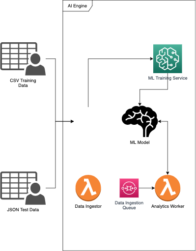

# nbwc-machine-learning-module-shipper-hack-2021
### This is a repository for machine learning module from NBWC team. These codes are developed solely for Shipper Hack 2021.

## Summary
1. These codes are developed to fulfill the theme: Automation for Put Away Process in Warehouses
2. These codes consists of 3 modules: training notebook (by AWS SageMaker Autopilot), data ingestor code (AWS Lambda), analytics worker code (AWS Lambda)
3. These codes are developed directly in the AWS system (SageMaker and Lambda), hence it is not commited periodically on this repo
4. The architecture of the machine learning module is as follows:

## NBWC Team Members
1. Anugrah Muzakki Puar
2. Kahlil Iman Gani
3. I Wayan Jnana Parantapa
4. Farhan Rabbaanii
5. I Dewa Putu Deny Krisna Amrita
